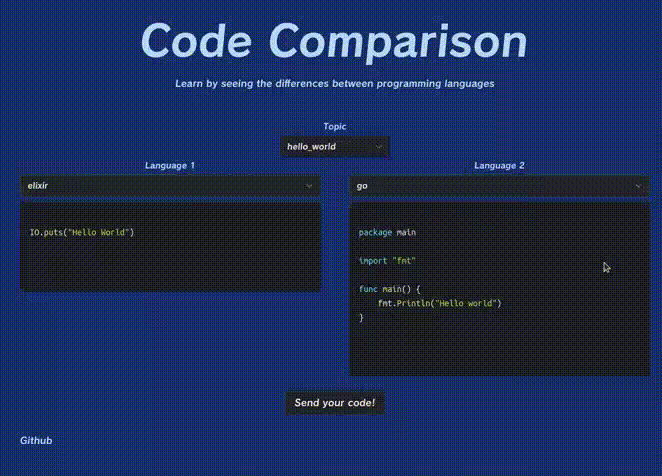

<h1 align="center">
      
</h1>

<h3 align="center">
  Code Comparison
</h3>

Learn by seeing the differences between programming languages 📚

Made with Elixir LiveView 🚀

🔗 <a href="codecomparison.me">codecomparison.me</a>

 

  

  

  

  

  <a href="#-installation-and-execution">Installation and execution</a>&nbsp;&nbsp;&nbsp;|&nbsp;&nbsp;&nbsp;
  <a href="#-tests">Tests</a>&nbsp;&nbsp;&nbsp;|&nbsp;&nbsp;&nbsp;
  <a href="#-how-to-contribute">How to contribute</a>&nbsp;&nbsp;&nbsp;

## 🎉 Presentation

<h1 align="left">
  
</h1>

## 🚀 Installation and execution

1. Clone this repository and go to the directory;
2. Install mix dependencies `docker-compose run --rm web mix deps.get`;
5. Install npm dependencies `docker-compose run --rm web npm install --prefix assets`;

## 🧪 Tests

1. Run `docker-compose run --rm web mix test`;

## 😊 We encorage you to submit your code!!

- Help us to increase the available code base.

- Go to /topics and create a new one or submit with the language you know.

- Please be concise and add comments explaining what the code is doing.

## 🤔 How to contribute

- Fork this repository;
- Create a branch with your feature: `git checkout -b my-feature`;
- Commit your changes: `git commit -m 'feat: My new feature'`;
- Push to your branch: `git push origin my-feature`.
- After the merge of your pull request is done, you can delete your branch.

---
